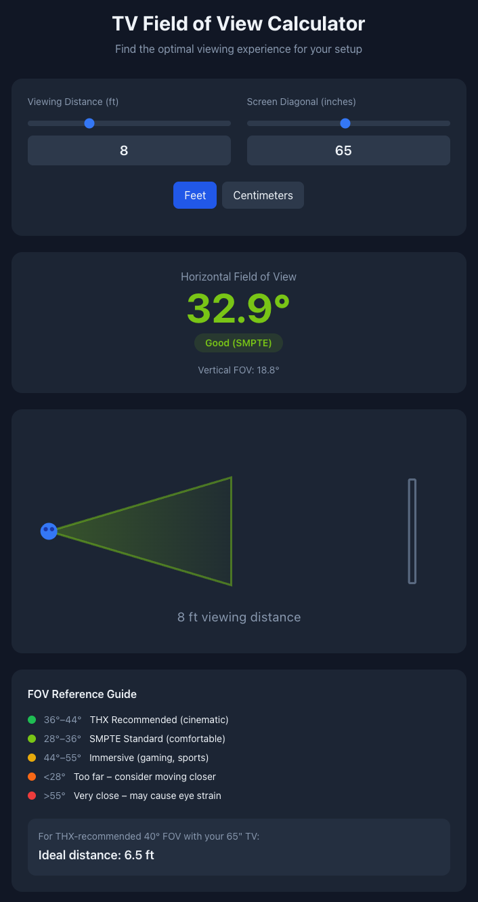

# TV Field of View Calculator

A simple interactive tool to calculate the horizontal field of view (FOV) your TV covers based on screen size and viewing distance.

## Why FOV Matters

The field of view determines how immersive your viewing experience feels. Industry standards like THX and SMPTE provide guidelines for optimal FOV ranges depending on your use case, whether you're watching movies, gaming, or casual viewing.

## Usage

Enter two values:
- **Viewing distance** – how far you sit from the TV (feet or centimeters)
- **Screen diagonal** – your TV's size in inches

The calculator displays your horizontal FOV and rates it against industry standards.

## The Math

For a 16:9 aspect ratio display:

```
Screen width = diagonal × (16 / √(16² + 9²))
FOV = 2 × arctan(width / (2 × distance))
```

## FOV Reference

| FOV Range | Rating | Best For |
|-----------|--------|----------|
| 36°–44° | THX Recommended | Cinematic experience |
| 28°–36° | SMPTE Standard | Comfortable everyday viewing |
| 44°–55° | Immersive | Gaming, sports |
| <28° | Too far | Consider sitting closer |
| >55° | Very close | May cause eye strain |

## Tech Stack

React with Tailwind CSS.

## License

MIT

